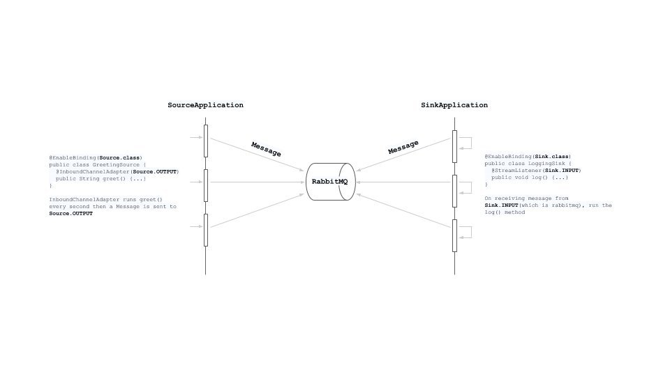
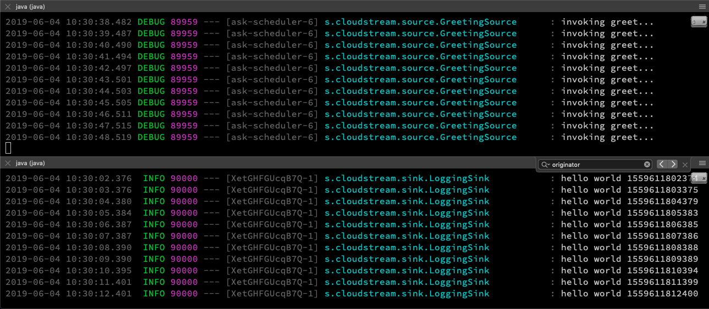
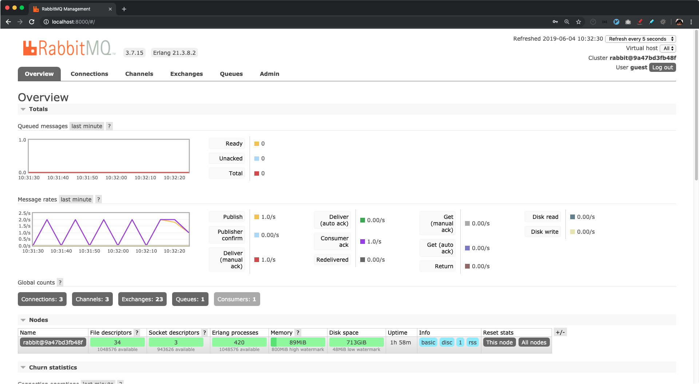

## Spring Cloud Stream

- https://github.com/JacobASeverson/stream-example-kinesis
- Producer/Publisher: `Source`, outputs `Message` via `MessageChannel` 
- Consumer/Subscriber: `Sink`, listen input from `SubscribeChannel`


#### Run

```bash
$ ./gradlew build
```

Sink application
```bash
$ java -jar sink/build/libs/sink-0.0.1-SNAPSHOT.jar \
    --spring.cloud.stream.bindings.input.destination=test_stream \
    --server.port=8090 
```

Source application
```bash
$ java -jar source/build/libs/source-0.0.1-SNAPSHOT.jar \
    --spring.cloud.stream.bindings.output.destination=test_stream 
```



See the link for RabbitMQ up and running. [https://github.com/appkr/spring-study/tree/master/cloud-stream#up-and-runnign-rabbitmq](https://github.com/appkr/spring-study/tree/master/cloud-stream#up-and-runnign-rabbitmq)


