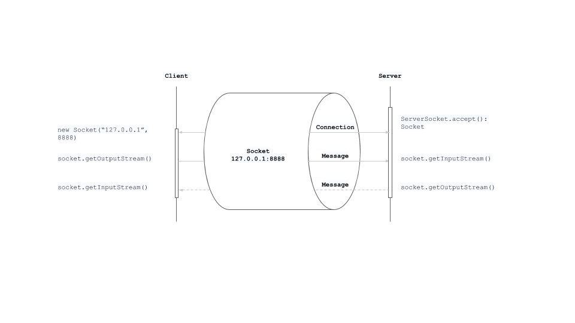

## A Guide to Java Sockets

- https://www.baeldung.com/a-guide-to-java-sockets
- https://www.baeldung.com/java-inputstream-server-socket

> The term **socket programming** refers to writing programs that execute across multiple computers in which the devices are all connected to each other using a network. There are two communication protocols that one can use for socket programming: User Datagram Protocol (UDP) and Transfer Control Protocol (TCP).

> By definition, a socket is one endpoint of a two-way communication link between two programs running on different computers on a network. A socket is bound to a port number so that the transport layer can identify the application that data is destined to be sent to.

---

- https://sime.tistory.com/m/76
