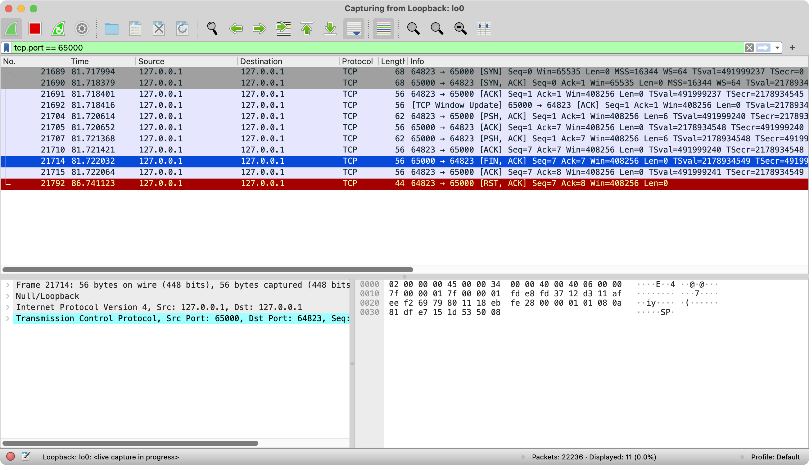

## java-socket5

Experiment project to test TCP interaction.

&nbsp;|client|server
---|---|---
case1|socket open|socket close
case2|socket close|socket open
case3|socket open|socket open
case4`++`|socket open|socket open

`++` case4 길이가 정해진 메시지인 경우

&nbsp;|length|description
---|---|---
header|4|lengh of body, left zero pad `e.g. 0005`
body|variable|message body `e.g. hello`

```
client ---headerbody--> server
client <--headerbody--- server
```

#### case 1
- Java Client에서 Hello 메시지 보내고, Server가 즉시 FIN 패킷을 보냄


#### case 2
- Java Client가 Hello 메시지 보내고 즉시 RST 패킷을 보냄


#### case 3
- Java Client가 Hello 메시지 보내고 대기함; Server도 응답을 보내고 대기함


#### case 4
- Java Client가 Hello 메시지 보내고 대기함; Server도 응답을 보내고 대기함

