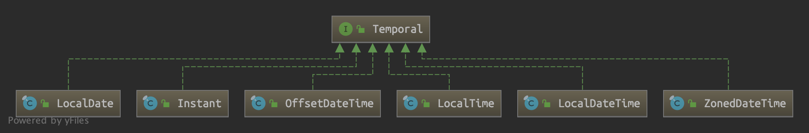

https://www.youtube.com/watch?v=n-xAqcBCws4

To import the project into IntelliJ
```bash
$ idea build.gradle
```

#### Reference
- [http://hochulshin.com/tag/#datastructure](http://hochulshin.com/tag/#datastructure)
    - Java - Priority Queue
    - Java - LinkedList 클래스
    - Java - ArrayList 클래스
    - Java - List 인터페이스
    - Java - Collection Framework

#### Byte to String
```java
jshell> String s = "Hello World";
s ==> "Hello World"

jshell> byte[] byteArray = s.getBytes();
byteArray ==> byte[11] { 72, 101, 108, 108, 111, 32, 87, 111, 114, 108, 100 }

jshell> new String(byteArray)
$1 ==> "Hello World"
```

#### Temporal Type


