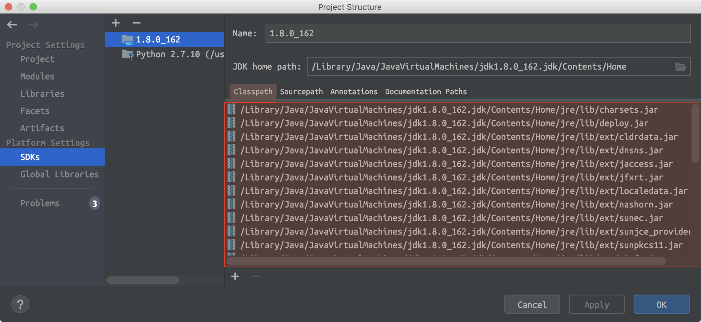
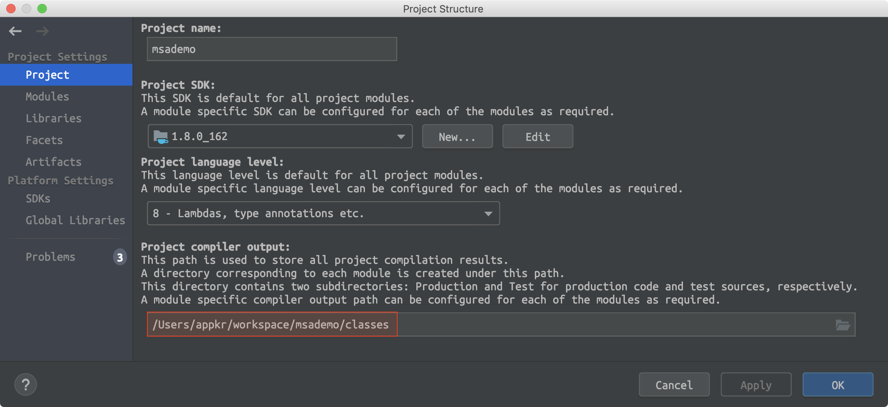

## What is Java Classpath

- 컴파일러, JVM이 클래스를 로드하기 위해 참조하는 경로들의 집합
- Basic: Package Path == Directory Structure
- Reference: http://kevinboone.net/classpath.html

#### Project Structure

```bash
$ tree
.
├── classes
│   └── dev
│       └── appkr
│           └── javacp
│               ├── CpTest1.class
│               └── CpTest2.class
└── dev
    └── appkr
        └── javacp
            ├── CpTest1.java
            └── CpTest2.java
```

#### Test Classes

```java
package dev.appkr.javacp;

public class CpTest1 {
    public static void main(String[] args) {
        System.out.println("Run CpTest1.main()");
    }
}
```

```java
package dev.appkr.javacp;

public class CpTest2 {
    public static void main(String[] args) {
        System.out.println("Run CpTest2.main()");
        CpTest1 cpt1 = new CpTest1();
    }
}
```

#### Run Test

```bash
~/dev/appkr/javacp $ javac -classpath "" CpTest1.java
~ $ java dev.appkr.javacp.CpTest1
# Run CpTest1.main()

~/dev/appkr/javacp $ javac -classpath "" CpTest2.java
# CpTest2.java:6: error: cannot find symbol
#         CpTest1 cpt1 = new CpTest1();

~/dev/appkr/javacp $ javac -classpath "../../.." CpTest2.java
~/dev/appkr/javacp $ javac -classpath "" CpTest1.java CpTest2.java
~ $ java dev.appkr.javacp.CpTest2
# Run CpTest2.main()

~ $ javac -d classes -classpath "" dev/appkr/javacp/CpTest1.java
~ $ javac -d classes -classpath classes dev/appkr/javacp/CpTest2.java
~/classes $ java dev.appkr.javacp.CpTest1
# Run CpTest1.main()
~/classes $ java dev.appkr.javacp.CpTest2
# Run CpTest2.main()
```

To add jar to classpath:

```bash
~ $ javac -classpath /myclasses/myclasses.jar ...
```

To add multiple classpath:

```bash
~ $ javac -classpath dir1:dir2:dir3 ...
```

To use system classpath:

```bash
~ $ javac -classpath $CLASSPATH:dir1:dir2 ...
```

#### IntelliJ




