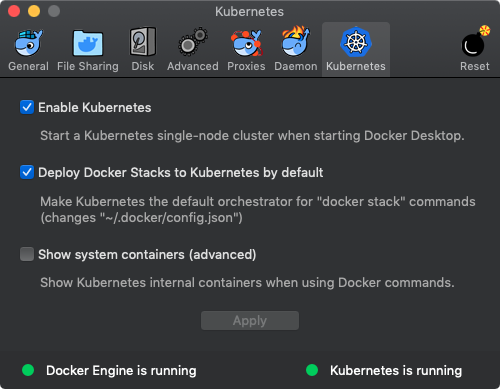

## Hello K8S

#### What is?
- [https://www.popit.kr/kubernetes-introduction/](https://www.popit.kr/kubernetes-introduction/)
- [https://kubernetes.io/docs/tutorials/kubernetes-basics/](https://kubernetes.io/docs/tutorials/kubernetes-basics/)
- [https://medium.com/google-cloud/kubernetes-nodeport-vs-loadbalancer-vs-ingress-when-should-i-use-what-922f010849e0](https://medium.com/google-cloud/kubernetes-nodeport-vs-loadbalancer-vs-ingress-when-should-i-use-what-922f010849e0)

#### Tutorial
- [https://www.youtube.com/watch?v=Ajno86DrZv8](https://www.youtube.com/watch?v=Ajno86DrZv8)
- [https://www.youtube.com/watch?v=l42GttmnnZ4&t=2132s](https://www.youtube.com/watch?v=l42GttmnnZ4&t=2132s)
- [https://medium.com/postman-engineering/deploying-a-scalable-web-application-with-docker-and-kubernetes-a5000a06c4e9](https://medium.com/postman-engineering/deploying-a-scalable-web-application-with-docker-and-kubernetes-a5000a06c4e9)

> host 머신 한대라면 docker run 이나 docker-compose 등 무엇으로 container 를 실행해도 상관 없습니다.  그러나 사용자가 많아지면 하나의 host 에서 모든 container 를 실행할 수 없습니다.  (host 에서 fail 이라도 발생하면..)  그러나 여러대의 host 에서 container 를 실행하려면 inter-host container 네트워킹과, host machine 의 리소스를 고려한 container 분배 등을 고려해야 합니다. 이런 문제들을 해결해주는 것이 바로 container orchestration 툴입니다.

- 여러 host (= node in k8s) 를 묶어 클러스터를 구성하고
- container 를 적절한 위치에 배포하고 (auto-placement)
- container 가 죽으면 자동으로 복구하며 (auto-restart)
- container 를 매끄럽게 추가(scaling), 복제(replication), 업데이트(rolling update), 롤백(rollback)

#### K8S Objects 


- `Cluster` A Kubernetes cluster consists of two types of resources:
    - The `Master` coordinates the cluster. The Master is responsible for managing the cluster.
    - `Nodes` are the workers that run applications. A node is a VM or a physical computer that serves as a worker machine in a Kubernetes cluster.
    - The nodes communicate with the master using the Kubernetes API


- `Deployment` a Deployment creates a `pod` and manages a Pod
    - The Deployment instructs Kubernetes how to create and update instances of your application
    - Deployment provides a self-healing mechanism to address machine failure or maintenance

```bash
deployment
└── replicaset
    └── pod
        └── container
```


- `Pod` A Pod is a Kubernetes abstraction that represents a group of one or more application containers (such as Docker or rkt), and some shared resources for those containers. Those resources include:
    - Shared storage, as Volumes
    - Networking, as a unique cluster IP address
    - Information about how to run each container, such as the container image version or specific ports to use

> The Pod is only accessible by its internal IP address within the Kubernetes cluster.
> In case of a Node failure, identical Pods are scheduled on other available Nodes in the cluster.


 
- `Service` A Service in Kubernetes is an abstraction which defines a logical set of Pods and a policy by which to access them. To make the Container accessible from outside the Kubernetes virtual network, you have to expose the Pod as a Kubernetes Service. Services can be exposed in different ways by specifying a type in the ServiceSpec:
    - ClusterIP (default)
    - NodePort
    - LoadBalancer
    - ExternalName


#### Native K8S on Docker for Mac



(OPTIONAL) `kb` 별칭을 등록합니다.
```bash
$ alias kb=kubectl
$ kb version --short
# Client Version: v1.13.3
# Server Version: v1.10.11
```

```bash
$ kb cluster-info
# Kubernetes master is running at https://localhost:6443
# KubeDNS is running at https://localhost:6443/api/v1/namespaces/kube-system/services/kube-dns:dns/proxy
```

```bash
$ kb get nodes
# NAME                 STATUS   ROLES    AGE   VERSION
# docker-for-desktop   Ready    master   2h    v1.10.11
```

#### K8S Web UI 

- https://kubernetes.io/docs/tasks/access-application-cluster/web-ui-dashboard/

파일로부터 대시보드를 만듭니다.
```bash
$ kb create -f https://raw.githubusercontent.com/kubernetes/dashboard/master/aio/deploy/recommended/kubernetes-dashboard.yamlsecret/kubernetes-dashboard-certs created
# secret/kubernetes-dashboard-csrf created
# serviceaccount/kubernetes-dashboard created
# role.rbac.authorization.k8s.io/kubernetes-dashboard-minimal created
# rolebinding.rbac.authorization.k8s.io/kubernetes-dashboard-minimal created
# deployment.apps/kubernetes-dashboard created
# service/kubernetes-dashboard created
```

생성된 서비스 계정의 토큰을 얻습니다 (마지막 줄).
```bash
$ kb -n kube-system describe secret $(kb -n kube-system get secret | grep default-token | awk '{print $1}')
# Name:         default-token-2cgg9
# Namespace:    kube-system
# Labels:       <none>
# Annotations:  kubernetes.io/service-account.name: default
#               kubernetes.io/service-account.uid: 80388105-455d-11e9-b22b-025000000001
# 
# Type:  kubernetes.io/service-account-token
# 
# Data
# ====
# ca.crt:     1025 bytes
# namespace:  11 bytes
# token:      ey..lw
```

프록시를 가동합니다.
```bash
$ kb proxy
```

대시보드를 오픈합니다.
```bash
$ open http://localhost:8001/api/v1/namespaces/kube-system/services/https:kubernetes-dashboard:/proxy/
```


#### Demo

##### Create Cluster
Docker for Mac 에서 K8S 활성화하면, 자등으로 생성

##### Example Application

```bash
# Dockerfile
FROM node:6.14.2
EXPOSE 8080
COPY server.js .
CMD node server.js
```

```javascript
// server.js
var http = require('http');

var handleRequest = function(request, response) {
  console.log('Received request for URL: ' + request.url);
  response.writeHead(200);
  response.end('Hello World! ' + process.env.HOSTNAME);
};

var www = http.createServer(handleRequest);
www.listen(8080);
```

```bash
$ docker build -t hello-k8s:v1 .

$ docker images
# REPOSITORY  TAG  IMAGE ID      CREATED         SIZE
# hello-k8s   v1   bdd0415aa54a  33 minutes ago  660MB
```

##### Deployments

```bash
$ kb run hello-k8s --image=hello-k8s:v1 --port=8080

$ kb get deployments
# NAME ...
# hello-k8s ...

$ kb get nodes -o wide
# NAME                 STATUS   ROLES    AGE   VERSION    EXTERNAL-IP   OS-IMAGE         KERNEL-VERSION     CONTAINER-RUNTIME
# docker-for-desktop   Ready    master   2h    v1.10.11   <none>        Docker for Mac   4.9.125-linuxkit   docker://18.9.1

$ kb get pods
# NAME                         READY   STATUS    RESTARTS   AGE   IP         NODE
# hello-k8s-6b457c7964-xq5dx   1/1     Running   0          11m   10.1.0.5   docker-for-desktop
```

##### Pods

```bash
$ kb proxy
# Starting to serve on 127.0.0.1:8001

$ curl http://localhost:8001/api/v1/namespaces/default/pods/hello-k8s-6b457c7964-xq5dx/proxy/
# Hello World!%

$ kb logs hello-k8s-6b457c7964-xq5dx
# Received request for URL: /

$ kb exec hello-k8s-6b457c7964-xq5dx cat server.js
# var http = require('http');

$ kb exec hello-k8s-6b457c7964-xq5dx -it bash
root@hello-k8s-6b457c7964-xq5dx:/# curl localhost:8080
# Hello World!
root@hello-k8s-6b457c7964-xq5dx:/# exit

$ kb describe pods hello-k8s-6b457c7964-xq5dx
# Name:           hello-k8s-6b457c7964-xq5dx
# ...
```

##### Services

```bash
$ kb get services
# NAME         TYPE        CLUSTER-IP   EXTERNAL-IP   PORT(S)   AGE
# kubernetes   ClusterIP   10.96.0.1    <none>        443/TCP   3h

$ kb expose deployment/hello-k8s --type="NodePort" --port="8080"
# service/hello-k8s exposed

$ kb get services
# NAME         TYPE        CLUSTER-IP     EXTERNAL-IP   PORT(S)          AGE
# hello-k8s    NodePort    10.99.205.52   <none>        8080:32456/TCP   15s
# kubernetes   ClusterIP   10.96.0.1      <none>        443/TCP          3h

$ kb describe services/hello-k8s
# Name:                     hello-k8s
# Selector:                 run=hello-k8s
# Type:                     NodePort
# TargetPort:               8080/TCP
# NodePort:                 <unset>  32456/TCP
# ...

$ curl -s localhost:32456
# Hello World!%

$ kb describe deployment
# Labels: run=hello-k8s

$ kb get pods -l run=hello-k8s
# NAME                         READY   STATUS    RESTARTS   AGE
# hello-k8s-6b457c7964-xq5dx   1/1     Running   0          39m

$ kb get services -l run=hello-k8s
# NAME        TYPE       CLUSTER-IP     EXTERNAL-IP   PORT(S)          AGE
# hello-k8s   NodePort   10.99.205.52   <none>        8080:32456/TCP   7m

$ kb label pod hello-k8s-6b457c7964-xq5dx app=v1
# pod/hello-k8s-6b457c7964-xq5dx labeled

$ kb describe pods hello-k8s-6b457c7964-xq5dx
# Labels: app=v1
#         pod-template-hash=2601373520
#         run=hello-k8s

$ kb get pods -l app=v1
# NAME                         READY   STATUS    RESTARTS   AGE
# hello-k8s-6b457c7964-xq5dx   1/1     Running   0          42m

$ kb delete service -l app=v1
$ kb get services
$ curl -s localhost:32456
$ kb exec hello-k8s-6b457c7964-xq5dx -it bash
# 외부에 노출되지만 않을 뿐, Pod가 삭제되지는 않음

# Pod를 삭제하려면
$ kb delete deployment {}
```


##### Scaling

```bash
$ kb get deployments
# NAME        DESIRED   CURRENT   UP-TO-DATE   AVAILABLE   AGE
# hello-k8s   1         1         1            1           4d
```

Scale out

```bash
$ kb scale deployments/hello-k8s --replicas=4
# deployment.extensions/hello-k8s scaled

$ kb get deployments
# NAME        DESIRED   CURRENT   UP-TO-DATE   AVAILABLE   AGE
# hello-k8s   4         4         4            4           4d

$ kb get pods -o wide
# NAME                         READY   STATUS    RESTARTS   AGE   IP          NODE
# hello-k8s-6b457c7964-8m44b   1/1     Running   0          2m    10.1.0.15   docker-for-desktop
# hello-k8s-6b457c7964-rfp59   1/1     Running   0          2m    10.1.0.13   docker-for-desktop
# hello-k8s-6b457c7964-xjfqs   1/1     Running   0          2m    10.1.0.14   docker-for-desktop
# hello-k8s-6b457c7964-xq5dx   1/1     Running   1          4d    10.1.0.10   docker-for-desktop

$ docker ps
# CONTAINER ID        IMAGE               STATUS              NAMES
# 62712c9b36ab        bdd0415aa54a        Up 8 seconds        k8s_..
# c07c3ad2aab1        bdd0415aa54a        Up 8 seconds        k8s_..
# bafdb58edb17        bdd0415aa54a        Up 8 seconds        k8s_..
# b2566f96b62b        bdd0415aa54a        Up 4 hours          k8s_..

$ kb describe deployments/hello-k8s
# Replicas:               4 desired | 4 updated | 4 total | 4 available | 0 unavailable
# StrategyType:           RollingUpdate
# RollingUpdateStrategy:  25% max unavailable, 25% max surge

$ kb describe service/hello-k8s
# Endpoints: 10.1.0.21:8080,10.1.0.23:8080,10.1.0.24:8080 + 1 more...
```

Scale in
```bash
$ kb scale deployments/hello-k8s --replicas=1
```

##### Update


```bash
$ kb set image deployments/hello-k8s hello-k8s=hello-k8s:v2
# deployment.extensions/hello-k8s image updated

$ kb get pods
# NAME                         READY   STATUS        RESTARTS   AGE
# hello-k8s-6b457c7964-xq5dx   1/1     Terminating   1          4d
# hello-k8s-7d995d9569-vvft9   1/1     Running       0          31s

$ kb rollout status deployments/hello-k8s
# deployment "hello-k8s" successfully rolled out
```

##### Rollback

```bash
$ kb set image deployments/hello-k8s hello-k8s=hello-k8s:v1
# deployment.extensions/hello-k8s image updated
```

Undo Rollback
```bash
$ kb rollout undo deployments/hello-k8s
# deployment.extensions/hello-k8s rolled back
```


#### Port Forward
```bash
$ kubectl --context={context} port-forward {k8sobject} -n {namespace} {localport}:{k8sport}
```

#### LoadBalancer and Ingress


```yaml
apiVersion: extensions/v1beta1
kind: Ingress
metadata:
  name: my-ingress
spec:
  backend:
    serviceName: other
    servicePort: 8080
  rules:
  - host: foo.mydomain.com
    http:
      paths:
      - backend:
          serviceName: foo
          servicePort: 8080
  - host: mydomain.com
    http:
      paths:
      - path: /bar/*
        backend:
          serviceName: bar
          servicePort: 8080
```

### Helm
- [https://medium.com/@elijudah/configuring-minimal-rbac-permissions-for-helm-and-tiller-e7d792511d10](https://medium.com/@elijudah/configuring-minimal-rbac-permissions-for-helm-and-tiller-e7d792511d10)
- a package manager for Kubernetes
- There are three parts to Helm: The Helm client (helm) the Helm server (Tiller) and the Charts themselves
- In a nutshell, the client is responsible for managing charts, and the server is responsible for managing releases.

#### Helm Client
The Helm Client is a command-line client for end users. The client is responsible for the following domains:

- Local chart development
- Managing repositories
- Interacting with the Tiller server
- Sending charts to be installed
- Asking for information about releases
- Requesting upgrading or uninstalling of existing releases

#### Tiller Server
The Tiller Server is an in-cluster server that interacts with the Helm client, and interfaces with the Kubernetes API server. The server is responsible for the following:

- Listening for incoming requests from the Helm client
- Combining a chart and configuration to build a release
- Installing charts into Kubernetes, and then tracking the subsequent release
- Upgrading and uninstalling charts by interacting with Kubernetes

#### Helm Chart
A Helm Chart is a collection of files that describe a related set of Kubernetes resources.
