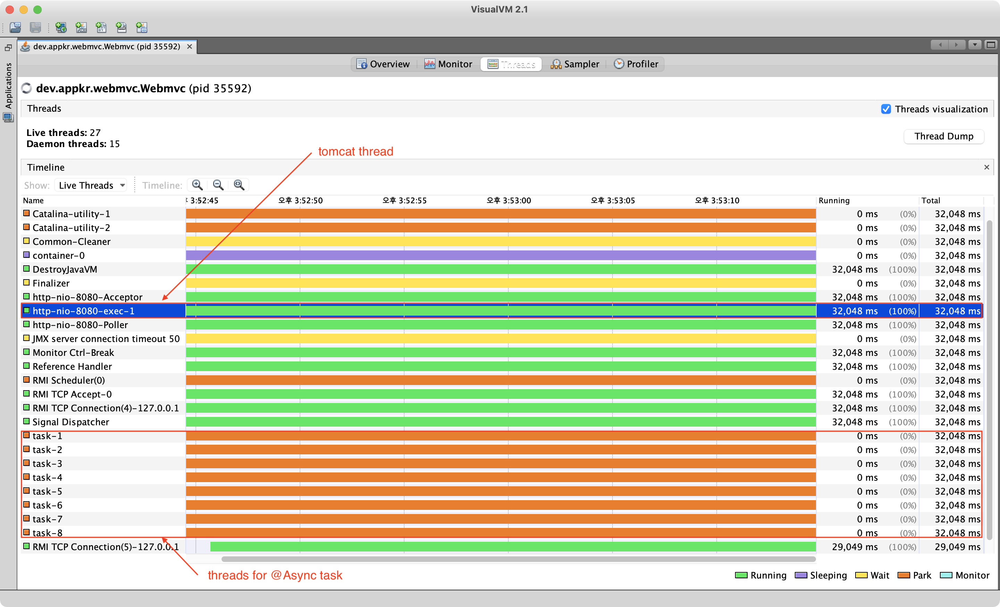

WebMVC vs WebFlux 컴퓨팅 리소스 사용 비교 실험

@see https://www.youtube.com/watch?v=ScH7NZU_zvk&list=PLv-xDnFD-nnmof-yoZQN8Fs2kVljIuFyC

#### Scenario


- Run Remote (TomcatWebServer with default setting)
- Run Webmvc (TomcatWebServer with 1 thread)
- Run LoadTest (Just a HTTP Client)

#### Observation



```bash
2022-04-03 16:10:52.087  INFO   --- [ool-1-thread-15] dev.appkr.webmvc.LoadTest                : Thread ready: 15
...
2022-04-03 16:10:54.745  INFO   --- [ool-1-thread-44] dev.appkr.webmvc.LoadTest                : Response: 44/remote1/remote2/internalService, Elapsed: 2.616022063
...
2022-04-03 16:14:14.503  INFO   --- [ool-1-thread-61] dev.appkr.webmvc.LoadTest                : Response: 61/remote1/remote2/internalService, Elapsed: 202.381099517
2022-04-03 16:14:14.503  INFO   --- [           main] dev.appkr.webmvc.LoadTest                : Total: 202.381099517
```