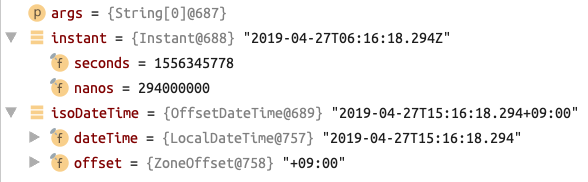

## Spring Guides Kata

- https://spring.io/guides

```bash
NAME=module1
spring init --build=gradle -g="$NAME" --package-name="$NAME" -d=web $NAME
```

#### module1 [Building a RESTful Web Service](https://spring.io/guides/gs/rest-service/)
```bash
$ open http://localhost:8080/demo1/greeting
```

#### module2 [Scheduling Tasks](https://spring.io/guides/gs/scheduling-tasks/)
```bash
2019-04-27 15:27:38.721  INFO 26738 --- [        main] module2.Module2        : Started Module2 in 4.226 seconds (JVM running for 4.942)
2019-04-27 15:27:43.659  INFO 26738 --- [scheduling-1] module2.ScheduledTasks : The time is now 15:27:43
2019-04-27 15:27:48.658  INFO 26738 --- [scheduling-1] module2.ScheduledTasks : The time is now 15:27:48
2019-04-27 15:27:53.659  INFO 26738 --- [scheduling-1] module2.ScheduledTasks : The time is now 15:27:53
```

#### module3 [Consuming a RESTful Web Service](https://spring.io/guides/gs/consuming-rest/)
```bash
2019-04-27 15:28:34.229  INFO 26740 --- [main] module3.Module3 : Started Module3 in 2.101 seconds (JVM running for 3.076)
2019-04-27 15:28:34.787  INFO 26740 --- [main] module3.Module3 : Quote{type='success', value=Value{id=6, quote='It embraces convention over configuration, providing an experience on par with frameworks that excel at early stage development, such as Ruby on Rails.'}}
```

#### module4 [Building Java Projects with Gradle](https://spring.io/guides/gs/gradle/)
```bash
~/module4 $ ./gradlew build
~/module4 $ java -jar build/libs/module4-0.0.1.jar
# The current local time is: 2019-04-27T15:16:51.743+09:00
# Hello world! 
```

For this module to be working, `jar` task must be defined!!
```groovy
mainClassName = 'module4.Module4'
jar {
    version =  '0.0.1'
    // REQUIRED!! TO MAKE EXECUTABLE JAR
    manifest {
        attributes 'Main-Class': mainClassName
    }
}
```

Note for Java time conversion
```java
Instant instant = Instant.now();
OffsetDateTime isoDateTime = OffsetDateTime.ofInstant(instant, ZoneId.systemDefault());
// ---
OffsetDateTime isoDateTime = OffsetDateTime.now();
Instant instant = isoDateTime.toInstant();
```


#### module5 [Accessing Relational Data using JDBC with Spring](https://spring.io/guides/gs/relational-data-access/)
```bash
2019-04-27 15:46:45.562  INFO 27626 --- [main] module5.Module5 : Started Module5 in 3.674 seconds (JVM running for 5.842)
2019-04-27 15:46:45.564  INFO 27626 --- [main] module5.Module5 : Creating tables
2019-04-27 15:46:45.590  INFO 27626 --- [main] module5.Module5 : Inserting customer record for John Woo
2019-04-27 15:46:45.590  INFO 27626 --- [main] module5.Module5 : Inserting customer record for Jeff Dean
2019-04-27 15:46:45.591  INFO 27626 --- [main] module5.Module5 : Inserting customer record for Josh Bloch
2019-04-27 15:46:45.591  INFO 27626 --- [main] module5.Module5 : Inserting customer record for Josh Long
2019-04-27 15:46:45.721  INFO 27626 --- [main] module5.Module5 : Querying for customer records where first_name = 'Josh':
2019-04-27 15:46:45.735  INFO 27626 --- [main] module5.Module5 : Customer{id=3, firstName='Josh', lastName='Bloch'}
2019-04-27 15:46:45.735  INFO 27626 --- [main] module5.Module5 : Customer{id=4, firstName='Josh', lastName='Long'}
```

#### module6 [Uploading Files](https://spring.io/guides/gs/uploading-files/)
```bash
$ open http://localhost:8080/demo6/
```

#### module7 [Validating Form Input](https://spring.io/guides/gs/validating-form-input/)
```bash
$ open http://localhost:8080/demo7/
```

#### module8 [Creating a Batch Service](https://spring.io/guides/gs/batch-processing/)
```bash
2019-04-27 16:31:09.461  INFO 30070 --- [    main] module8.Module8                        : Started Module8 in 2.902 seconds (JVM running for 4.6)
2019-04-27 16:31:09.463  INFO 30070 --- [    main] o.s.b.a.b.JobLauncherCommandLineRunner : Running default command line with: []
2019-04-27 16:31:09.585  INFO 30070 --- [    main] o.s.b.c.l.support.SimpleJobLauncher    : Job: [FlowJob: [name=importUserJob]] launched with the following parameters: [{run.id=1}]
2019-04-27 16:31:09.605  INFO 30070 --- [    main] o.s.batch.core.job.SimpleStepHandler   : Executing step: [step1]
2019-04-27 16:31:09.689  INFO 30070 --- [    main] module8.PersonItemProcessor            : Converting Person{lastName='Doe', firstName='Jill'} into Person{lastName='JILL', firstName='DOE'}
2019-04-27 16:31:09.689  INFO 30070 --- [    main] module8.PersonItemProcessor            : Converting Person{lastName='Doe', firstName='Joe'} into Person{lastName='JOE', firstName='DOE'}
2019-04-27 16:31:09.689  INFO 30070 --- [    main] module8.PersonItemProcessor            : Converting Person{lastName='Doe', firstName='Justin'} into Person{lastName='JUSTIN', firstName='DOE'}
2019-04-27 16:31:09.689  INFO 30070 --- [    main] module8.PersonItemProcessor            : Converting Person{lastName='Doe', firstName='Jane'} into Person{lastName='JANE', firstName='DOE'}
2019-04-27 16:31:09.689  INFO 30070 --- [    main] module8.PersonItemProcessor            : Converting Person{lastName='Doe', firstName='John'} into Person{lastName='JOHN', firstName='DOE'}
2019-04-27 16:31:09.700  INFO 30070 --- [    main] m.JobCompletionNotificationListener    : JOB FINISHED! Time to verify the results
2019-04-27 16:31:09.703  INFO 30070 --- [    main] m.JobCompletionNotificationListener    : Found Person{lastName='DOE', firstName='JILL'} in the database.
2019-04-27 16:31:09.703  INFO 30070 --- [    main] m.JobCompletionNotificationListener    : Found Person{lastName='DOE', firstName='JOE'} in the database.
2019-04-27 16:31:09.703  INFO 30070 --- [    main] m.JobCompletionNotificationListener    : Found Person{lastName='DOE', firstName='JUSTIN'} in the database.
2019-04-27 16:31:09.704  INFO 30070 --- [    main] m.JobCompletionNotificationListener    : Found Person{lastName='DOE', firstName='JANE'} in the database.
2019-04-27 16:31:09.704  INFO 30070 --- [    main] m.JobCompletionNotificationListener    : Found Person{lastName='DOE', firstName='JOHN'} in the database.
2019-04-27 16:31:09.707  INFO 30070 --- [    main] o.s.b.c.l.support.SimpleJobLauncher    : Job: [FlowJob: [name=importUserJob]] completed with the following parameters: [{run.id=1}] and the following status: [COMPLETED]
```

#### module9 [Caching Data with Spring](https://spring.io/guides/gs/caching/)
```bash
2019-04-27 16:37:50.647  INFO 30583 --- [main] module9.Module9   : Started Module9 in 1.228 seconds (JVM running for 2.371)
2019-04-27 16:37:50.650  INFO 30583 --- [main] module9.AppRunner : ... Fetching books
2019-04-27 16:37:53.664  INFO 30583 --- [main] module9.AppRunner : isbn-1234 ---> Book{isbn='isbn-1234', title='Some book'}
2019-04-27 16:37:56.672  INFO 30583 --- [main] module9.AppRunner : isbn-4567 ---> Book{isbn='isbn-4567', title='Some book'}
# Cache fill completed and read model from cache
2019-04-27 16:37:56.675  INFO 30583 --- [main] module9.AppRunner : isbn-1234 ---> Book{isbn='isbn-1234', title='Some book'}
2019-04-27 16:37:56.675  INFO 30583 --- [main] module9.AppRunner : isbn-4567 ---> Book{isbn='isbn-4567', title='Some book'}
2019-04-27 16:37:56.675  INFO 30583 --- [main] module9.AppRunner : isbn-1234 ---> Book{isbn='isbn-1234', title='Some book'}
2019-04-27 16:37:56.676  INFO 30583 --- [main] module9.AppRunner : isbn-1234 ---> Book{isbn='isbn-1234', title='Some book'}
```
#### module10 [Managing Transactions](https://spring.io/guides/gs/managing-transactions/)
```bash
2019-04-27 16:46:14.225  INFO 31074 --- [main] module10.Module10       : Started Module10 in 1.73 seconds (JVM running for 3.161)
2019-04-27 16:46:14.240  INFO 31074 --- [main] module10.BookingService : Booking Alice in a seat...
2019-04-27 16:46:14.261  INFO 31074 --- [main] module10.BookingService : Booking Bob in a seat...
2019-04-27 16:46:14.262  INFO 31074 --- [main] module10.BookingService : Booking Carol in a seat...
2019-04-27 16:46:14.287  INFO 31074 --- [main] module10.AppRunner      : Alice, Bob and Carol have been booked
2019-04-27 16:46:14.287  INFO 31074 --- [main] module10.BookingService : Booking Chris in a seat...
2019-04-27 16:46:14.287  INFO 31074 --- [main] module10.BookingService : Booking Samuel in a seat...
2019-04-27 16:46:14.404  INFO 31074 --- [main] module10.AppRunner      : v--- The following exception is expect because 'Samuel' is too big to the DB ---v
2019-04-27 16:46:14.404 ERROR 31074 --- [main] module10.AppRunner      : PreparedStatementCallback; SQL [INSERT INTO bookings(first_name) VALUES (?)]; Value too long for column """FIRST_NAME"" VARCHAR(5) NOT NULL": "'Samuel' (6)"; SQL statement: INSERT INTO bookings(first_name) VALUES (?) [22001-199]; nested exception is org.h2.jdbc.JdbcSQLDataException: Value too long for column """FIRST_NAME"" VARCHAR(5) NOT NULL": "'Samuel' (6)"; SQL statement: INSERT INTO bookings(first_name) VALUES (?) [22001-199]
2019-04-27 16:46:14.405  INFO 31074 --- [main] module10.AppRunner      : So far, Alice is booked
2019-04-27 16:46:14.405  INFO 31074 --- [main] module10.AppRunner      : So far, Bob is booked
2019-04-27 16:46:14.405  INFO 31074 --- [main] module10.AppRunner      : So far, Carol is booked
2019-04-27 16:46:14.405  INFO 31074 --- [main] module10.AppRunner      : You shouldn't see Chris or Samuel. Samuel violated DB constraints, and Chris was rolled back in the same TX
2019-04-27 16:46:14.406  INFO 31074 --- [main] module10.BookingService : Booking Buddy in a seat...
2019-04-27 16:46:14.406  INFO 31074 --- [main] module10.BookingService : Booking null in a seat...
2019-04-27 16:46:14.408 ERROR 31074 --- [main] module10.AppRunner      : PreparedStatementCallback; SQL [INSERT INTO bookings(first_name) VALUES (?)]; NULL not allowed for column "FIRST_NAME"; SQL statement: INSERT INTO bookings(first_name) VALUES (?) [23502-199]; nested exception is org.h2.jdbc.JdbcSQLIntegrityConstraintViolationException: NULL not allowed for column "FIRST_NAME"; SQL statement: INSERT INTO bookings(first_name) VALUES (?) [23502-199]
2019-04-27 16:46:14.409  INFO 31074 --- [main] module10.AppRunner      : So far, Alice is booked
2019-04-27 16:46:14.409  INFO 31074 --- [main] module10.AppRunner      : So far, Bob is booked
2019-04-27 16:46:14.409  INFO 31074 --- [main] module10.AppRunner      : So far, Carol is booked
2019-04-27 16:46:14.409  INFO 31074 --- [main] module10.AppRunner      : You shouldn't see Buddy or null. null violated DB constraint, and Buddy was rolled back in the same Tx
```

#### module11 [Accessing Data with JPA](https://spring.io/guides/gs/accessing-data-jpa/)
```bash
2019-04-27 17:23:30.658  INFO 31862 --- [     main] module11.Module11                        : Started Module11 in 4.539 seconds (JVM running for 6.439)
2019-04-27 17:23:30.747  INFO 31862 --- [     main] module11.Module11                        : Customers found with findAll():
2019-04-27 17:23:30.747  INFO 31862 --- [     main] module11.Module11                        : -------------------------------
2019-04-27 17:23:30.767  INFO 31862 --- [     main] o.h.h.i.QueryTranslatorFactoryInitiator  : HHH000397: Using ASTQueryTranslatorFactory
2019-04-27 17:23:30.899  INFO 31862 --- [     main] module11.Module11                        : Customer{id=1, firstName='Jack', lastName='Bauer'}
2019-04-27 17:23:30.899  INFO 31862 --- [     main] module11.Module11                        : Customer{id=2, firstName='Chloe', lastName='O'Brian'}
2019-04-27 17:23:30.899  INFO 31862 --- [     main] module11.Module11                        : Customer{id=3, firstName='Kim', lastName='Bauer'}
2019-04-27 17:23:30.899  INFO 31862 --- [     main] module11.Module11                        : Customer{id=4, firstName='David', lastName='Palmer'}
2019-04-27 17:23:30.899  INFO 31862 --- [     main] module11.Module11                        : Customer{id=5, firstName='Michelle', lastName='Dessler'}
2019-04-27 17:23:30.899  INFO 31862 --- [     main] module11.Module11                        : 
2019-04-27 17:23:30.913  INFO 31862 --- [     main] module11.Module11                        : Customer found with findById(1L):
2019-04-27 17:23:30.913  INFO 31862 --- [     main] module11.Module11                        : -------------------------------
2019-04-27 17:23:30.913  INFO 31862 --- [     main] module11.Module11                        : Customer{id=1, firstName='Jack', lastName='Bauer'}
2019-04-27 17:23:30.913  INFO 31862 --- [     main] module11.Module11                        : 
2019-04-27 17:23:30.913  INFO 31862 --- [     main] module11.Module11                        : Customer found with findByLastName('Bauer'):
2019-04-27 17:23:30.913  INFO 31862 --- [     main] module11.Module11                        : -------------------------------
2019-04-27 17:23:30.990  INFO 31862 --- [     main] module11.Module11                        : Customer{id=1, firstName='Jack', lastName='Bauer'}
2019-04-27 17:23:30.991  INFO 31862 --- [     main] module11.Module11                        : Customer{id=3, firstName='Kim', lastName='Bauer'}
2019-04-27 17:23:30.997  INFO 31862 --- [Thread-11] j.LocalContainerEntityManagerFactoryBean : Closing JPA EntityManagerFactory for persistence unit 'default'
```

#### module12 [Accessing data with MySQL](https://spring.io/guides/gs/accessing-data-mysql/)
```bash
$ curl -X GET http://localhost:8080/module12/add?name=Foo&email=foo@bar.com
$ curl -X GET http://localhost:8080/module12/all
# [
#   {
#     "id": 1,
#     "name": "Foo",
#     "email": "foo@bar.com"
#   }
# ]
```

#### module13 [Messaging with JMS](https://spring.io/guides/gs/messaging-jms/)
```bash
2019-04-27 18:46:11.181  INFO 35923 --- [main] module13.Module13 : Started Module13 in 2.545 seconds (JVM running for 4.281)
Sending an email message.
Receiver <Email{to='info@example.com', body='Hello'}>
```

#### module14 [Creating Asynchronous Methods](https://spring.io/guides/gs/async-method/)
```bash
2019-04-28 16:32:48.297  INFO 36720 --- [          main] module14.Module14                       : Started Module14 in 2.632 seconds (JVM running for 3.65)
2019-04-28 16:32:48.314  INFO 36720 --- [GithubLookup-1] module14.GithubLookupService            : Looking up PivotalSoftware
2019-04-28 16:32:48.314  INFO 36720 --- [GithubLookup-2] module14.GithubLookupService            : Looking up CloudFoundry
2019-04-28 16:32:50.514  INFO 36720 --- [GithubLookup-1] module14.GithubLookupService            : Looking up Spring-Projects
2019-04-28 16:32:51.762  INFO 36720 --- [          main] module14.AppRunner                      : Elapsed time: 3463
2019-04-28 16:32:51.762  INFO 36720 --- [          main] module14.AppRunner                      : --> User{name='Pivotal Software, Inc.', blog='http://pivotal.io'}
2019-04-28 16:32:51.762  INFO 36720 --- [          main] module14.AppRunner                      : --> User{name='Cloud Foundry', blog='https://www.cloudfoundry.org/'}
2019-04-28 16:32:51.762  INFO 36720 --- [          main] module14.AppRunner                      : --> User{name='Spring', blog='http://spring.io/projects'}
2019-04-28 16:32:51.767  INFO 36720 --- [          main] o.s.s.concurrent.ThreadPoolTaskExecutor : Shutting down ExecutorService 'taskExecutor'
```

#### module15 [Building a Reactive RESTful Web Service](https://spring.io/guides/gs/reactive-rest-service/) **NOT WORKING**
```bash
$ open http://localhost:8080/module15/hello
```

## Spring Reference

#### Core1 [Customizing Beans by Using a BeanPostProcessor](https://docs.spring.io/spring/docs/5.1.6.RELEASE/spring-framework-reference/core.html#beans-factory-extension-bpp)
Bean decoration example
```bash
BEAN_POST_PROCESSING: Bean 'greeting' created : core1.Core1$Greeting@35835fa
Hello World
```
